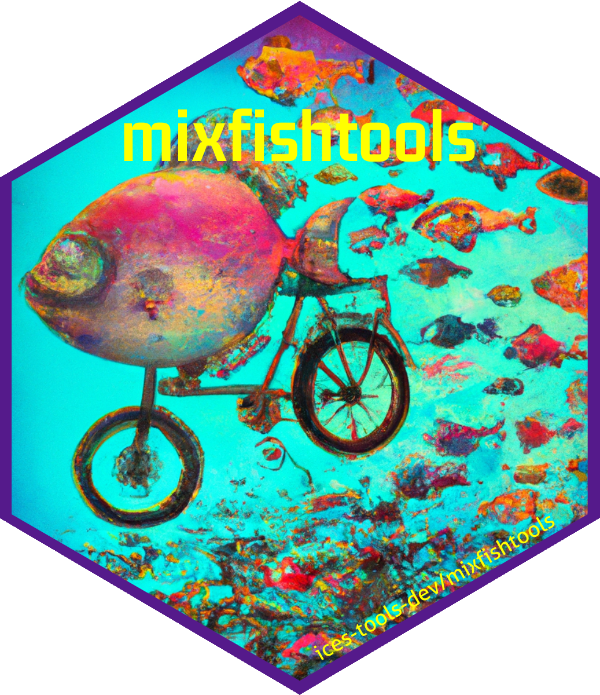

# mixfishtools

[](https://ices-tools-prod.r-universe.dev)

**To install:**

```         
# install pre-compiled package (preferred)
install.packages('mixfishtools', repo = 'https://ices-tools-prod.r-universe.dev')

# install from source
library(remotes)
install_github(repo = "ices-tools-dev/mixfishtools")
```

# Vignettes

-   ***mixfishtools guide***- Guide to use of the *mixfishtools* functions.

-   ***Reproduce advice*** - WGMIXFISH quality control procedure to test the reproduction of single stock advice forecasts before proceeding with mixed fishery modelling scenarios.

To build directly during installation: `remotes::install_github(repo = "ices-tools-dev/mixfishtools", build_vignettes = TRUE)`, 
followed by `browseVignettes(package = "mixfishtools")` to view.

Both Rmarkdown documents to produce the vignettes are found in the '/vignettes' subfolder of the repo. 
When using the cloned repo, these can be built using `devtools::build_vignettes()`. 

